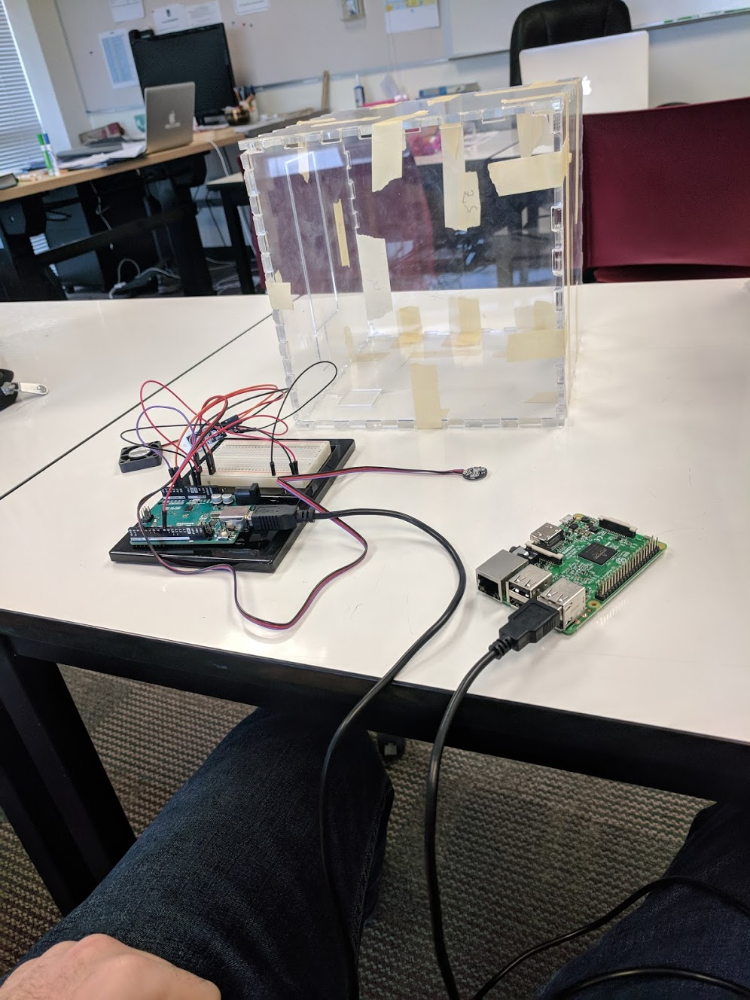
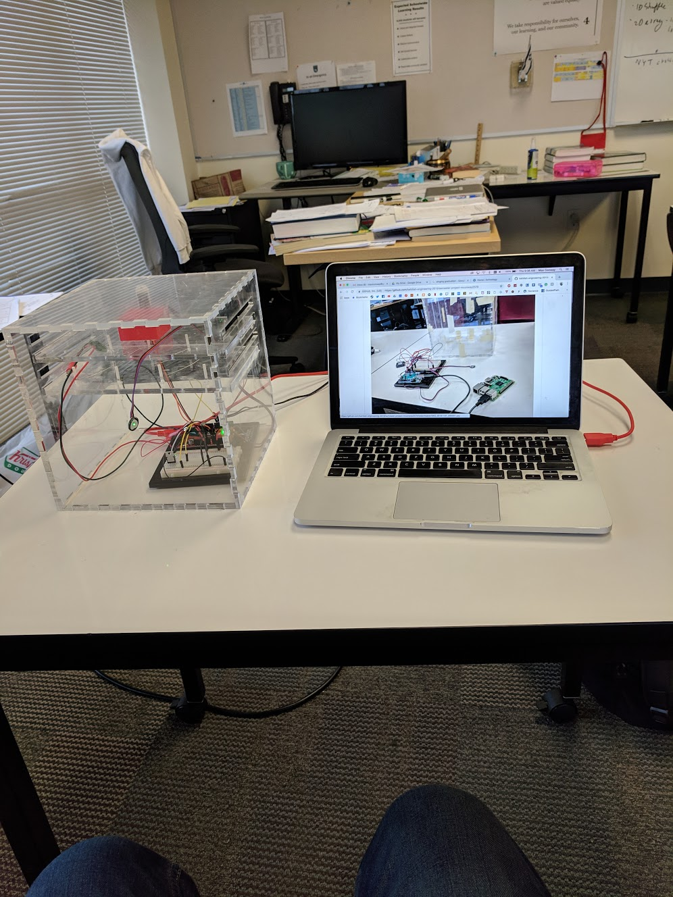

# semester-project-mconway2579
The goal of this project is to incubate live chickens

====================================================================================

11/1/18

at this point I have a box printed, working temperature and humidity sensor, fan, and pulse sensor. all of these can display to a raspberry pi

Unfortunantly our last model, if I could do a next model I would build it taller to actually fit an egg.
The kenthal heating has failed, I wish I had started with it so that I could have moved on faster.
